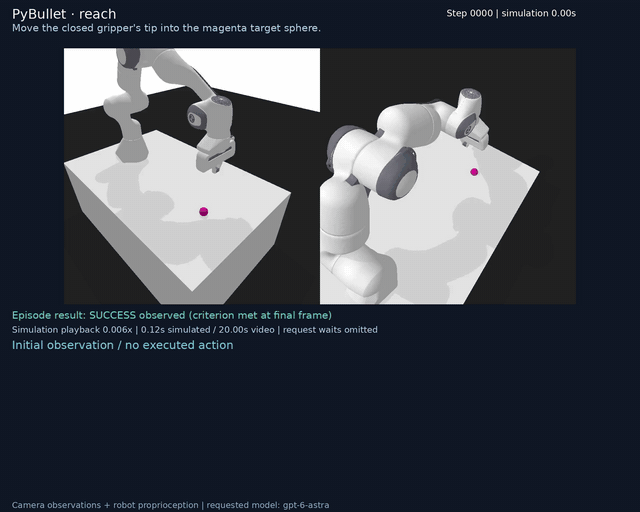
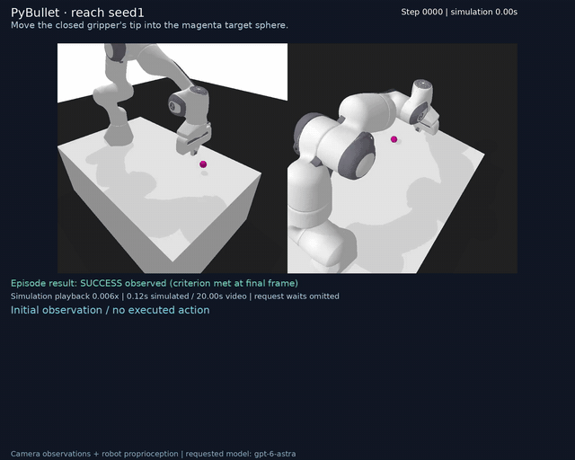
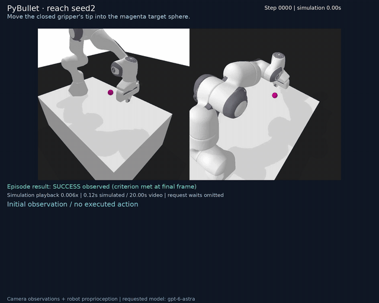
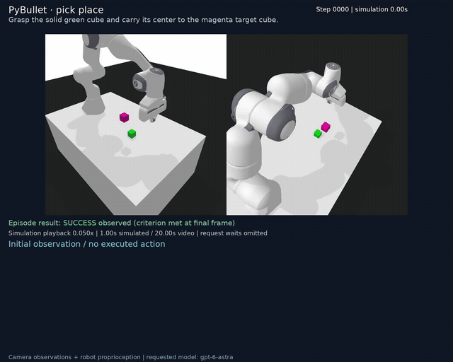

## Separate PyBullet simulator pilot

These additional trials explore a different simulator and controller interface. They are separate from the ten-task MuJoCo pilot: different tasks, initial states, controllers, and control horizons prevent a controlled simulator comparison. These few selected trials do not establish a reliable success rate or identify the cause of earlier failures.

The table reports recorded evaluator outcomes; exact instructions, request settings, action specifications, and policy inputs/outputs accompany each recording. Videos show executed commands and request latency. Simulation playback is slowed for readability and omits model waiting time; GIFs are compressed overviews.

| Task | Recorded outcome | Decisions | Requests | Control steps | Wall time |
|---|---|---:|---:|---:|---:|
| PyBullet · reach | Success at end | 1 | 1 | 3 | 0.3 min |
| PyBullet · reach seed1 | Success at end | 1 | 1 | 3 | 0.3 min |
| PyBullet · reach seed2 | Success at end | 1 | 1 | 3 | 0.3 min |
| PyBullet · pick place | Success at end | 10 | 10 | 25 | 2.8 min |

**PyBullet · reach — Success at end**

Move the closed gripper's tip into the magenta target sphere.

[MP4 with Astra commands](bullet_reach/annotated.mp4) · [Result](bullet_reach/result.json) · [Configuration](bullet_reach/config.json) · [Action specification](bullet_reach/action_spec.json) · [Exact policy trace](bullet_reach/policy_trace.txt)

**PyBullet · reach seed1 — Success at end**

Move the closed gripper's tip into the magenta target sphere.

[MP4 with Astra commands](bullet_reach_seed1/annotated.mp4) · [Result](bullet_reach_seed1/result.json) · [Configuration](bullet_reach_seed1/config.json) · [Action specification](bullet_reach_seed1/action_spec.json) · [Exact policy trace](bullet_reach_seed1/policy_trace.txt)

**PyBullet · reach seed2 — Success at end**

Move the closed gripper's tip into the magenta target sphere.

[MP4 with Astra commands](bullet_reach_seed2/annotated.mp4) · [Result](bullet_reach_seed2/result.json) · [Configuration](bullet_reach_seed2/config.json) · [Action specification](bullet_reach_seed2/action_spec.json) · [Exact policy trace](bullet_reach_seed2/policy_trace.txt)

**PyBullet · pick place — Success at end**

Grasp the solid green cube and carry its center to the magenta target cube.

[MP4 with Astra commands](bullet_pick_place/annotated.mp4) · [Result](bullet_pick_place/result.json) · [Configuration](bullet_pick_place/config.json) · [Action specification](bullet_pick_place/action_spec.json) · [Exact policy trace](bullet_pick_place/policy_trace.txt)
