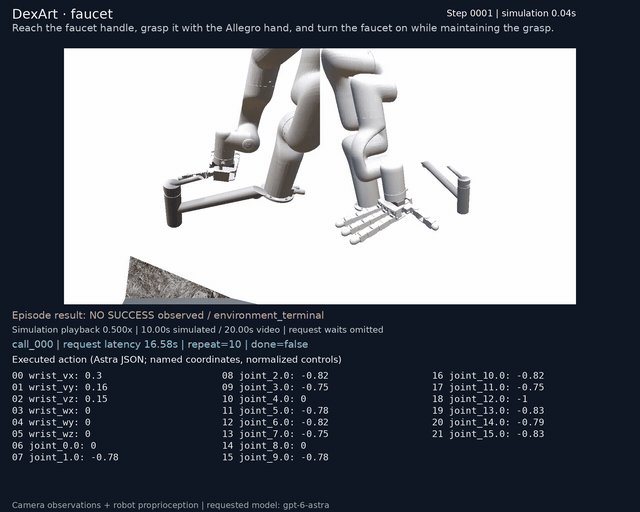
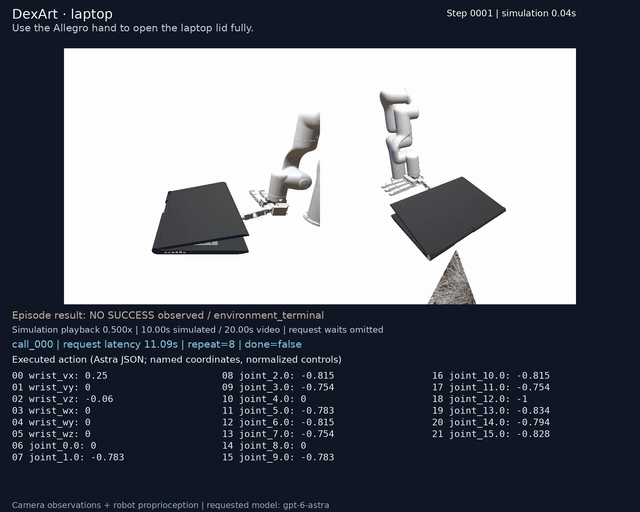
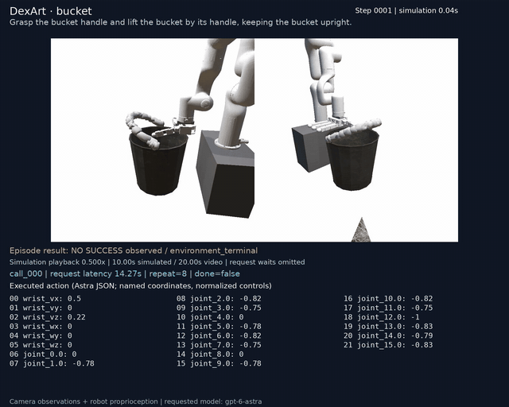
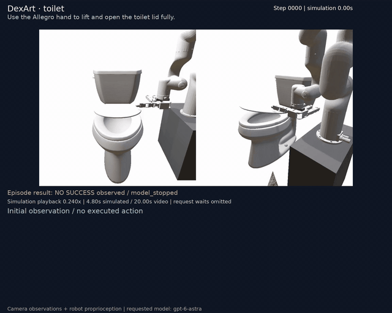

## DexArt / SAPIEN dexterous-hand pilot

Four native articulated-object tasks—faucet, laptop, bucket and toilet—are evaluated with one predetermined seen instance per task and intended seed 0. Actual instance IDs, seeds and budgets are recorded below. This small pilot does not establish a reliable success rate, generalization to unseen objects, or a controlled comparison with the other simulators.

Astra supplies the native wrist and finger commands using fixed-camera RGB and robot proprioception. No trained RL policy, expert action sequence or added grasp controller runs the robot. Outcomes come from DexArt's native task evaluation, including its contact criteria; errors and interruptions are reported separately from completed trials.

Videos overlay exact executed actions and request latency. Simulation playback is slowed for readability and omits request waiting time; GIFs summarize the full recording. Exact policy inputs, outputs and request-error traces accompany each result.

| Task | Instance / split | Seed | Recorded outcome | Decisions / requests | Steps | Wall time |
|---|---|---:|---|---:|---:|---:|
| DexArt · faucet | 148 / seen | 0 | No success observed | 40 / 40 | 250 | 12.0 min |
| DexArt · laptop | 11395 / seen | 0 | No success observed | 40 / 40 | 250 | 8.7 min |
| DexArt · bucket | 100431 / seen | 0 | No success observed | 37 / 37 | 250 | 6.8 min |
| DexArt · toilet | 102677 / seen | 0 | No success observed | 15 / 15 | 120 | 3.0 min |

Recorded budgets and interfaces:

| Task | Decision budget | Requested step budget | Native horizon | Max repeat | Control interval | Reasoning |
|---|---:|---:|---:|---:|---:|---|
| DexArt · faucet | 40 | 250 | 250 | 10 | 0.04000000189989805 s | medium |
| DexArt · laptop | 40 | 250 | 250 | 10 | 0.04000000189989805 s | medium |
| DexArt · bucket | 40 | 250 | 250 | 10 | 0.04000000189989805 s | medium |
| DexArt · toilet | 40 | 250 | 250 | 10 | 0.04000000189989805 s | medium |

**DexArt · faucet — No success observed**

Reach the faucet handle, grasp it with the Allegro hand, and turn the faucet on while maintaining the grasp.

[MP4 with Astra commands](dexart_faucet/annotated.mp4)

[Result](dexart_faucet/result.json) · [Exact policy trace](dexart_faucet/policy_trace.txt) · [Configuration](dexart_faucet/config.json) · [Action specification](dexart_faucet/action_spec.json) · [Evaluator record](dexart_faucet/evaluation.json) · [Final available frame](dexart_faucet/live.png)

**DexArt · laptop — No success observed**

Use the Allegro hand to open the laptop lid fully.

[MP4 with Astra commands](dexart_laptop/annotated.mp4)

[Result](dexart_laptop/result.json) · [Exact policy trace](dexart_laptop/policy_trace.txt) · [Configuration](dexart_laptop/config.json) · [Action specification](dexart_laptop/action_spec.json) · [Evaluator record](dexart_laptop/evaluation.json) · [Final available frame](dexart_laptop/live.png)

**DexArt · bucket — No success observed**

Grasp the bucket handle and lift the bucket by its handle, keeping the bucket upright.

[MP4 with Astra commands](dexart_bucket/annotated.mp4)

[Result](dexart_bucket/result.json) · [Exact policy trace](dexart_bucket/policy_trace.txt) · [Configuration](dexart_bucket/config.json) · [Action specification](dexart_bucket/action_spec.json) · [Evaluator record](dexart_bucket/evaluation.json) · [Final available frame](dexart_bucket/live.png)

**DexArt · toilet — No success observed**

Use the Allegro hand to lift and open the toilet lid fully.

[MP4 with Astra commands](dexart_toilet/annotated.mp4)

[Result](dexart_toilet/result.json) · [Exact policy trace](dexart_toilet/policy_trace.txt) · [Configuration](dexart_toilet/config.json) · [Action specification](dexart_toilet/action_spec.json) · [Evaluator record](dexart_toilet/evaluation.json) · [Final available frame](dexart_toilet/live.png)
