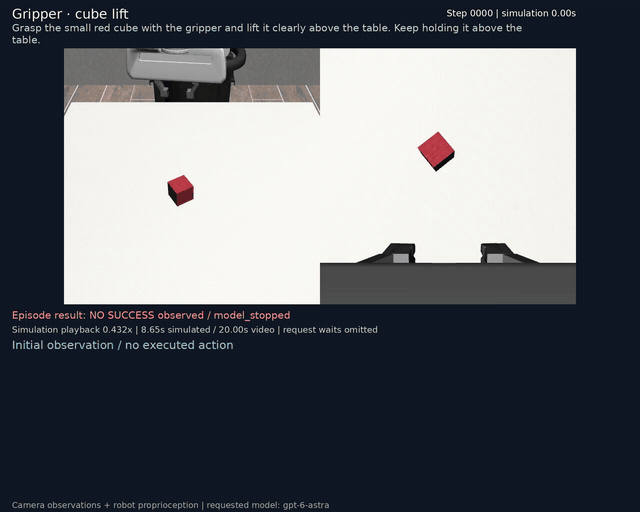
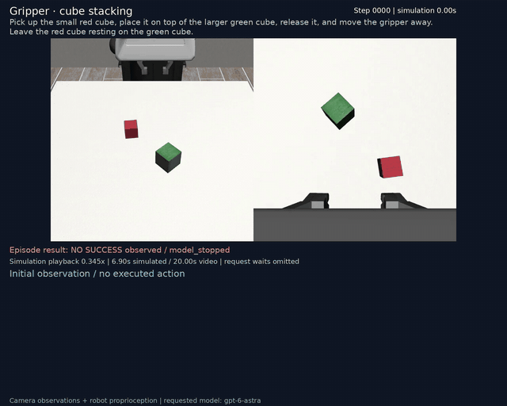
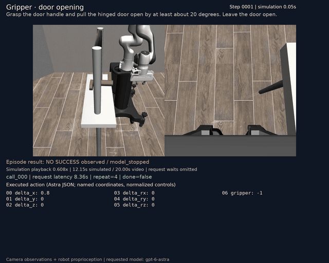
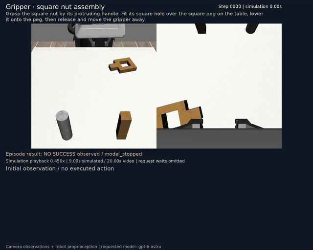
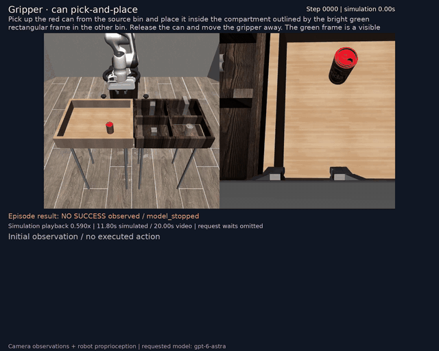
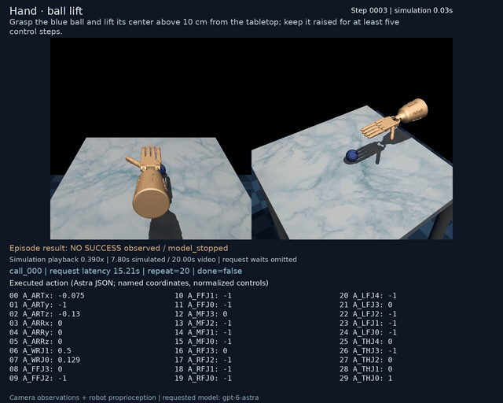
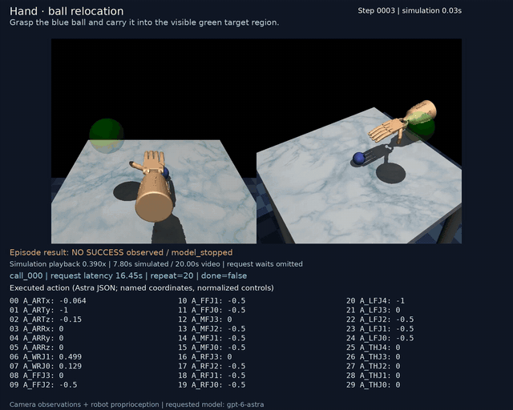
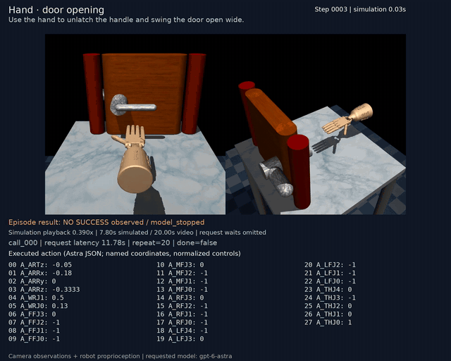
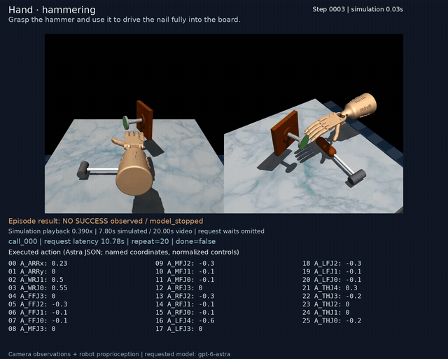
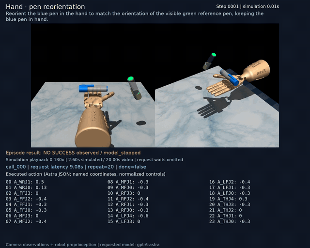

## Ten-task Astra pilot

One recorded trial per task. This is exploratory evidence, not a reliable success-rate estimate. See each task's config.json for its exact initialization, model request, and budgets.

Recorded suite settings: requested model: gpt-6-astra; reasoning: medium; seed: 0; decision limit per task: 40; control-step limit: 800; hand view pixels per side: 768; gripper view pixels per side: 512.

The hand receives two calibrated RGB views; the gripper receives external and wrist RGB views. Inputs also include robot proprioception and static actuator documentation. Object states and evaluator feedback are excluded. The hand ball-lift task is a custom lift-and-hold subtask; the other tasks use native benchmark success checks. The can destination has a visible green outline.

Videos include exact executed Astra action values, repeat count, request latency, simulation time, and final episode outcome. Playback is slowed for readability; model waiting time is omitted. GIFs are compressed overviews of the full trajectory. MP4s retain the larger, readable overlay.

| Task | Outcome at end | Decisions | Requests | Control steps | Wall time |
|---|---|---:|---:|---:|---:|
| Gripper · cube lift | Not achieved | 40 | 40 | 173 | 7.0 min |
| Hand · ball lift | Not achieved | 40 | 40 | 780 | 12.6 min |
| Gripper · cube stacking | Not achieved | 40 | 40 | 138 | 7.4 min |
| Hand · ball relocation | Not achieved | 40 | 40 | 780 | 13.8 min |
| Gripper · door opening | Not achieved | 40 | 40 | 243 | 9.5 min |
| Hand · door opening | Not achieved | 40 | 40 | 780 | 12.6 min |
| Gripper · square nut assembly | Not achieved | 40 | 40 | 180 | 8.0 min |
| Hand · hammering | Not achieved | 40 | 40 | 780 | 10.7 min |
| Gripper · can pick-and-place | Not achieved | 40 | 40 | 236 | 7.4 min |
| Hand · pen reorientation | Not achieved | 14 | 14 | 260 | 4.3 min |

### Gripper videos

**Gripper · cube lift — Not achieved**

[MP4 with Astra commands](gripper_lift/annotated.mp4) · [Result](gripper_lift/result.json) · [Exact policy trace](gripper_lift/policy_trace.json)

**Gripper · cube stacking — Not achieved**

[MP4 with Astra commands](gripper_stack/annotated.mp4) · [Result](gripper_stack/result.json) · [Exact policy trace](gripper_stack/policy_trace.json)

**Gripper · door opening — Not achieved**

[MP4 with Astra commands](gripper_door/annotated.mp4) · [Result](gripper_door/result.json) · [Exact policy trace](gripper_door/policy_trace.json)

**Gripper · square nut assembly — Not achieved**

[MP4 with Astra commands](gripper_nut_assembly_square/annotated.mp4) · [Result](gripper_nut_assembly_square/result.json) · [Exact policy trace](gripper_nut_assembly_square/policy_trace.json)

**Gripper · can pick-and-place — Not achieved**

[MP4 with Astra commands](gripper_pick_place_can/annotated.mp4) · [Result](gripper_pick_place_can/result.json) · [Exact policy trace](gripper_pick_place_can/policy_trace.json)

### Hand videos

**Hand · ball lift — Not achieved**

[MP4 with Astra commands](hand_ball_lift/annotated.mp4) · [Result](hand_ball_lift/result.json) · [Exact policy trace](hand_ball_lift/policy_trace.json)

**Hand · ball relocation — Not achieved**

[MP4 with Astra commands](hand_relocate/annotated.mp4) · [Result](hand_relocate/result.json) · [Exact policy trace](hand_relocate/policy_trace.json)

**Hand · door opening — Not achieved**

[MP4 with Astra commands](hand_door/annotated.mp4) · [Result](hand_door/result.json) · [Exact policy trace](hand_door/policy_trace.json)

**Hand · hammering — Not achieved**

[MP4 with Astra commands](hand_hammer/annotated.mp4) · [Result](hand_hammer/result.json) · [Exact policy trace](hand_hammer/policy_trace.json)

**Hand · pen reorientation — Not achieved**

[MP4 with Astra commands](hand_pen/annotated.mp4) · [Result](hand_pen/result.json) · [Exact policy trace](hand_pen/policy_trace.json)
